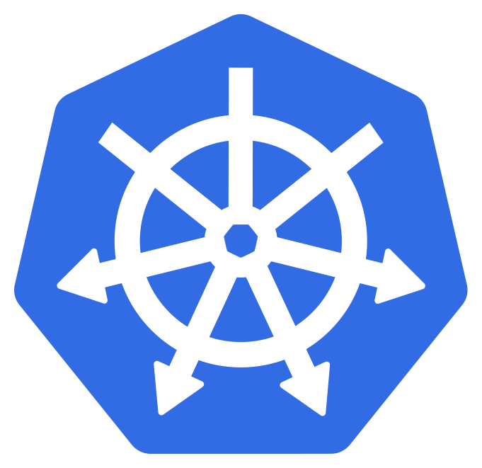
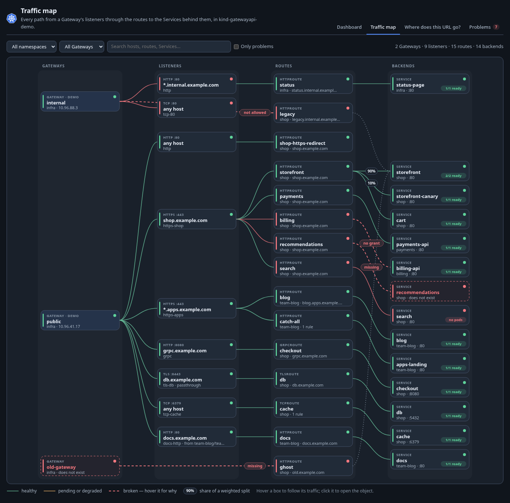
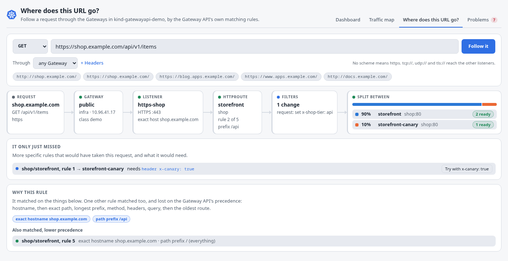
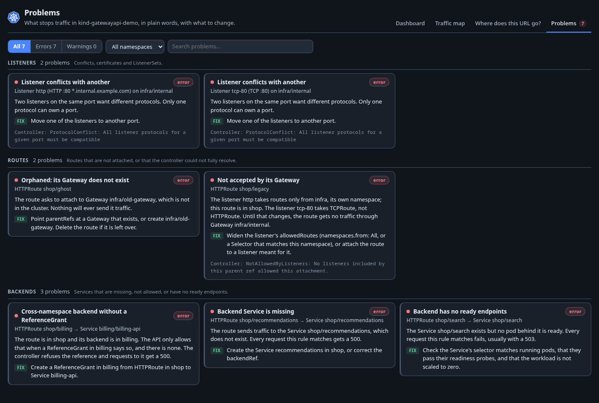

# Gateway API for K8s Dockside

A [K8s Dockside](https://github.com/k8sdockside/k8sdockside) plugin for the
[Kubernetes Gateway API](https://gateway-api.sigs.k8s.io): Gateways, their
listeners, the routes attached to them and the Services behind those, drawn
as the paths traffic actually takes.

The app already lists every Gateway API kind as a table. What a table cannot
say is how they join up -- that a request for `shop.example.com/api` lands on
one listener of one Gateway, matches the second rule of one HTTPRoute, and is
split 90/10 between two Services, one of them with no ready pods. This plugin
says that, for any implementation.

<!-- markdownlint-disable-next-line MD033 -->




## What it shows

**Dashboard** -- a verdict in one sentence, then four tiles: Gateway classes,
Gateways, routes and problems, each divided by state. Under them what needs
attention, worst first, each row opening the object it is about; a box to
type a URL into; and every Gateway with its address and listeners, and the
number of routes on each.

**Traffic map** -- every path from a Gateway, through a listener
(protocol, port, hostname), a route (HTTP, gRPC, TLS, TCP, UDP), to the
backend Service and how many of its endpoints are ready. Boxes and edges are
coloured by the conditions the controller wrote -- `Accepted`, `Programmed`,
`ResolvedRefs`, `Conflicted` -- and the share of a weighted split is written on
its edge. Where a path breaks the edge is dashed red and says why:

- a route its Gateway refused hangs off the Gateway itself, marked *not
  allowed* or *hostname mismatch*, because it reached no listener;
- a route whose Gateway does not exist hangs off a dashed ghost of it;
- a backend Service that is not there is a dashed ghost too, marked *missing*;
- a backend in another namespace with no ReferenceGrant is marked *no grant*.

Filter by namespace and Gateway, search hosts, routes and Services, or keep
only the paths with problems. Filters work on whole paths, so searching for a
Service still shows the Gateway and listener in front of it. A listener with
more than eight routes is folded into one box until you open it. Hovering a
box lights up every path through it; clicking opens it in the app.

**Where does this URL go?** -- type `https://shop.example.com/api/v1` (and a
method and headers, if they matter) and the page runs it through the Gateway
API's own matching rules against the routes in the cluster. It lays out the
answer as the path the request takes: the Gateway, the listener chosen by
hostname specificity, the route and rule chosen by precedence, what the
filters do to the request (rewrites, header changes, mirrors), and where it
ends up -- split between backends by weight, redirected with the `Location`
worked out, or failing with the status it would get and why. Under it: what
decided the rule, which other rules matched and lost, and which more specific
rule the request only just missed, with a button that adds the header it
needed. `grpc://`, `tls://`, `tcp://` and `udp://` addresses reach the other
listener types. Nothing is sent; the answer comes from the objects.



**Problems** -- every Gateway, listener and route condition that is not
healthy, orphaned routes, listener conflicts, certificates and backends in
other namespaces without a ReferenceGrant, missing Services and Services with
no ready endpoints. Each says what is wrong in plain words, what to change,
and the controller's own reason and message, verbatim, to search for.



**Panels** on Gateways (a small map of the listeners and what is attached to
each, and a table of the listeners), on every route kind (where it is
attached, each rule's matches, filters and backends with their weights and
ready endpoints, and a link to follow it in the URL resolver) and on Services
(which routes send traffic there, for which hosts and paths, what share, and
through which Gateway).

More screenshots: [the dashboard](docs/screenshots/dashboard-light.png),
[the traffic map in light](docs/screenshots/traffic-map-light.png),
[the Gateway panel](docs/screenshots/gateway-panel-dark.png) and
[the HTTPRoute panel](docs/screenshots/route-panel-light.png).

### How it matches a URL

The rules are the API's own, from the field documentation in
`gateway.networking.k8s.io/v1`, and each is a test in
`src/model/match.test.ts`:

1. **The listener.** Its protocol fits the scheme and its port the URL's; then
   the most specific hostname wins -- exact, then the longer wildcard, then the
   shorter one, then none. `*.example.com` matches `a.b.example.com` but not
   `example.com`. A URL on a port no listener has (a port-forward, a load
   balancer mapping 443 to 8443) still finds its listener, and the page says
   the port was mapped.
2. **The route.** Among the routes on that listener, the one whose matching
   hostname has the most characters when exact, then the most characters at
   all. Route hostnames outside the listener's are ignored.
3. **The rule.** An `Exact` path, then the longest `PathPrefix` (matched
   element by element: `/pay` is not a prefix of `/payment`), then a method
   match, then the most header matches, then the most query matches; then the
   oldest route, then `{namespace}/{name}`, then the first rule and match in
   list order. A `RegularExpression` path's precedence is
   implementation-specific; it ranks below exact and prefix matches here, and
   the page says so when that decided anything. GRPCRoutes use their own
   order: hostname, then characters in the matched service, then the method,
   then header matches.

## What it reads, and what it changes

It reads the Gateway API's own kinds -- GatewayClasses, Gateways,
ListenerSets, HTTPRoutes, GRPCRoutes, TLSRoutes, TCPRoutes, UDPRoutes,
ReferenceGrants and BackendTLSPolicies -- and Services, EndpointSlices and
Namespaces (for the labels a listener's namespace selector matches). It reads
no implementation's own resources, and never Secrets: a listener's
certificate is shown by name, and whether a ReferenceGrant lets the Gateway
use it.

Every kind but GatewayClasses, Gateways and HTTPRoutes is optional: a cluster
with an older Gateway API, without ListenerSets or the TLS, TCP and UDP
routes, gets the rest of the plugin.

**It changes nothing.** The manifest does not ask for write access, and there
are no actions.

## Installing

In K8s Dockside: **Settings → Plugins → From a repository**:

```text
https://github.com/k8sdockside/gatewayapi.git
```

Needs K8s Dockside 0.1.12 or newer.

## Trying it

`dev/` makes a kind cluster with the Gateway API CRDs, Envoy Gateway and a
demo shop in which every state above shows up: a canary split, a GRPCRoute,
a cross-namespace backend with and without a ReferenceGrant, a missing
Service, one scaled to zero, a refused route, an orphaned one, conflicting
listeners, a wildcard listener, TLS and TCP routes and a ListenerSet.

```sh
dev/up.sh      # kind cluster, CRDs, Envoy Gateway, the demo
dev/down.sh    # and away again
```

[`dev/README.md`](dev/README.md) says what it installs, at which versions and
why, what each object in the demo should look like in the plugin, and how to
send real requests through the Gateway to compare.

## Working on it

The pages are TypeScript in `src/`, bundled into `ui/` -- which is what the app
serves, and what installing clones, so `ui/` is committed and must be in step
with `src/`.

```sh
npm install
npm run build     # src/ -> ui/
npm run watch     # rebuild on every change; reopen the tab to see it
npm run preview   # draw every page to preview/, with no cluster
npm run check     # typecheck, unit tests, and ui/ against a fresh build
```

`npm run preview` is the one to reach for first. It runs every page against
the fixtures in `src/fixtures.ts` -- the `dev/` demo, with the statuses a
controller writes on it -- and writes them to `preview/` as standalone HTML in
both the app's light and dark themes, including the URL resolver on a split,
a redirect and a refused backend. Open `preview/index.html`. The buttons do
nothing there: there is no app behind them.

To see your changes in the app without installing anything: **Settings →
Plugins → Watch another folder**, point it at this checkout, and press
**Reload** after each build.

To check the manifest the way the app does:

```sh
go run github.com/k8sdockside/k8sdockside/cmd/plugincheck@v0.1.12 .
```

### How it is laid out

| | |
| --- | --- |
| `plugin.json` | the manifest: views, cards, panels |
| `src/model/` | what the Gateway API means -- attachment, precedence, problems, the map's graph and layout -- with the tests |
| `src/ui/` | the pieces the pages are drawn from: the SVG map, tiles, pills, backend rows |
| `src/pages/` | one `.ts` and one `.html` per page, plus `render.test.ts` |
| `src/styles/` | one stylesheet, written in the app's theme tokens only |
| `dev/` | the kind cluster and the demo |

Everything with Gateway API knowledge in it lives in `src/model/` and is
tested without a cluster. `topology.ts` joins the objects, taking the
controller's status as the truth and the spec's rules -- sectionName, port,
`allowedRoutes`, hostname intersection, ReferenceGrants -- as the
explanation, so a route no controller has looked at is still explained.
`match.ts` is the URL resolver, `problems.ts` the plain-words problems,
`graph.ts` the map. The field names in `src/model/types.ts` are the JSON tags
of the v1 API, checked against the v1.6.1 CRDs.

## Credit

The [Gateway API](https://gateway-api.sigs.k8s.io) is a project of Kubernetes
SIG Network. The mark this plugin ships is the project's own, unchanged, from
the logo it publishes in its repository
([`kubernetes-sigs/gateway-api`](https://github.com/kubernetes-sigs/gateway-api/blob/main/site/static/images/logo/logo.svg)),
with only the editor's metadata dropped. It is used only to name what this
plugin is about; the plugin is not part of the project.

Apache 2.0 -- see [LICENSE](LICENSE).
